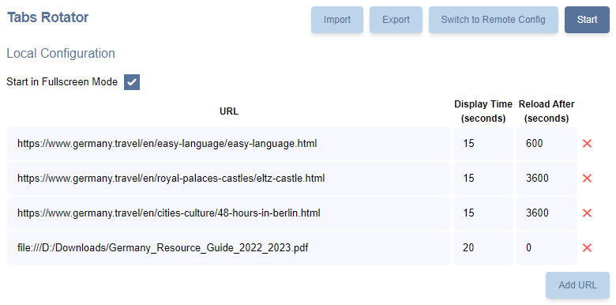

# Chrome Tabs Rotator / Slideshow

## Overview

Chrome Tabs Rotator automatically loads URLs in new tabs and display them as a slideshow. It is useful for displaying dashboards, monitoring tools, presentations, advertisements, reports, marketing, or any other web pages that need to be cycled through regularly on a screen.

## Features

- Switch between tabs with web pages from the Internet or on your local PC using `file://` links.
- Set display time and reload interval for each URL.
- Manage configuration in the extension or load from a URL with automatic updates.
- Automatically retries loading links if errors occur and skips failed pages until they are available again.
- It continues to work after the browser restarts and prevents tab spamming.

## Screenshots




## Support

If you find a bug, please create an issue on GitHub [chrome-tabs-rotator](https://github.com/skarpovru/chrome-tabs-rotator).

---

## Development

To develop the extension locally, follow these steps:

1. Install Dependencies (requires Node.js v18 or higher, npm, and yarn):

   ```sh
   yarn
   ```

2. Build and Zip the Extension:

   ```sh
   yarn build
   ```

   This command will clean out the `dist` directory, build the project, and package the result into a zip file for distribution.

3. Start the Development Server:

   ```sh
   yarn start
   ```

   This command will watch for changes and rebuild the project automatically.

4. Load the Extension in Chrome:

   - Open Chrome and navigate to [`chrome://extensions/`](chrome://extensions/).
   - Enable "Developer mode" using the toggle switch in the top right corner.
   - Click "Load unpacked" and select the project subfolder in the `dist` directory.
